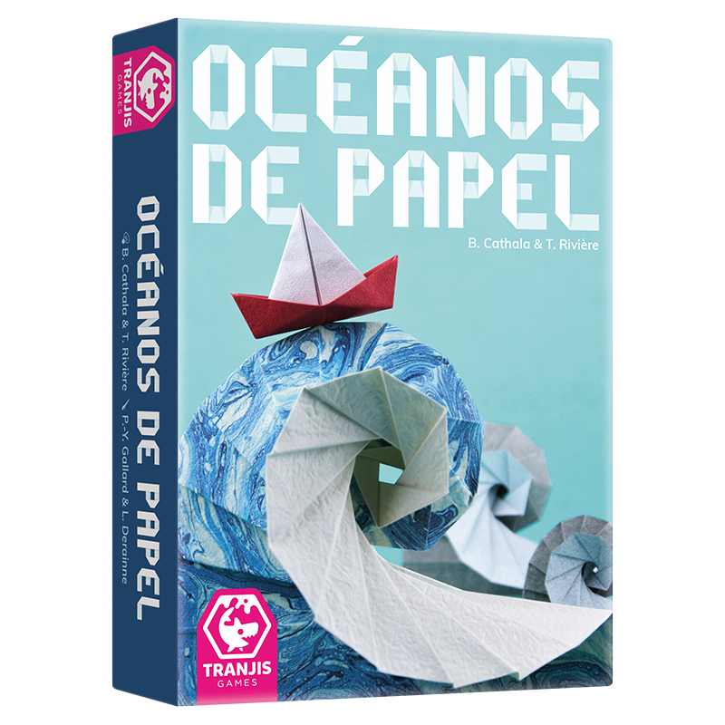

# oceanos-juego



## Tutorial: ¿cómo hago mi bot?

1. Copiar el archivo `src/jugador/base.py` en el mismo directorio con otro nombre, como `BotFachero.py`.
2. Modificar el nombre de la clase `JugadorBase` por otro, como `BotFachero`.
3. Hacer que `BotFachero` herede de la clase `JugadorBase` (la sintaxis es `class BotFachero(JugadorBase)`).
4. Implementar los métodos de la interfaz de `BotFacero` que dicen "implementame".
5. ¡Bot implementado! Probarlo usando el archivo `matchup/matchup.py`, cambiando los parámetros que aparecen al principio del archivo para que se use el `BotFachero`.

Para entender qué deberían hacer los métodos a implementar y cómo, revisar la documentación (archivos README.md en las subcarpetas de `src/`)

¡Que las Cuatro Sirenas guíen tu camino!

## Componentes

### Partida
La clase `PartidaDeOcéanos` modela el estado y acciones posibles a lo largo de una única partida del juego (con múltiples rondas) entre 2-4 jugadores. Tiene métodos para realizar las acciones correspondientes en cada momento, y expone las propiedades que el jugador actual debería concoer en una partida real.

```python
>>> from juego.partida import PartidaDeOcéanos
>>> partida = PartidaDeOcéanos(cantidadDeJugadores=2)
>>> partida.iniciarRonda()
>>> partida.deQuiénEsTurno
0
>>> partida.topeDelDescarte[0]
Carta de Cangrejo negro
>>> partida.robarDelDescarte(0)
Carta de Cangrejo negro
>>> partida.topeDelDescarte[0]
None
>>> partida.mano.total()
1
```

Para más información sobre los métodos y atributos disponibles para usar en los Bots, ver [el README de juego/](src\juego\README.md).

### Administrador de Juego

La clase `AdministradorDeJuego` actúa como puente entre instancias de `PartidaDeOcéanos` y los Bots. Su tarea es invocar los métodos correspondientes que los Bots implementan y usar sus respuestas para resolver las diferentes fases del juego con llamadas a métodos de `PartidaDeOcéanos`.

Para más información sobre cómo el administrador traduce entre `PartidaDeOcéanos` y Bots, ver [el README de administrador/](src\administrador\README.md).

```python
>>> administrador = AdministradorDeJuego([RandyBot, BotFachero], verbose=False)
>>> ganador = administrador.jugarPartida()
0
>>> ganador = administrador.jugarPartida()
1
```

### Jugadores

Para que un jugador pueda entenderse con el `AdministradorDeJuego`, se necesita que [subclasifique](https://www.w3schools.com/python/python_inheritance.asp) la clase `JugadorBase`. Esta clase define los cinco métodos que `AdministradorDeJuego` invoca sobre cada jugador para resolver las acciones de juego (cómo se quiere robar, si se quieren jugar dúos, cómo se pasa de ronda, etc.). Por supuesto, además de implementar estos métodos necesarios, un jugador puede definir tantas variables internas y métodos auxiliares como sean necesarios.

Para más información sobre cómo implementar un Bot y ejemplos, ver [el README de jugador/](src\jugador\README.md).

```python
>>> juego = PartidaDeOcéanos(cantidadDeJugaodres=2)
>>> miBot = RandyBot()
>>> otroBot = SirenaEnjoyer()
>>> miBot.configurarParaJuego(juego, númeroDeJugador=0, listaDeEventos=None)
>>> otroBot.configurarParaJuego(juego, númeroDeJugador=1, listaDeEventos=None)
>>> juego.iniciarRonda()
>>> miBot.decidirAcciónDeRobo()
Acción.Robo.DEL_MAZO
>>> cartas = juego.robarDelMazo()
[Carta de Pulpo verde, Carta de Pez negro]
>>> miBot.decidirCómoRobarDelMazo(cartas)
(0, 1)
```

### Matchups

`src/matchup/matchup.py` utiliza los parámetros definidos al principio del archivo para disputar una serie de partidas entre Bots. Para ello, utiliza el `AdministradorDeJuego` y las métricas que éste recolecta para generar estadísticas del duelo. Para usarlo, simplemente modificar los parámetros `jugadoresDelMatchup`, `nombres` y `cantidadDePartidasAJugar`, y luego iniciar el duelo con `cd src/ && python -m matchup.matchup`.